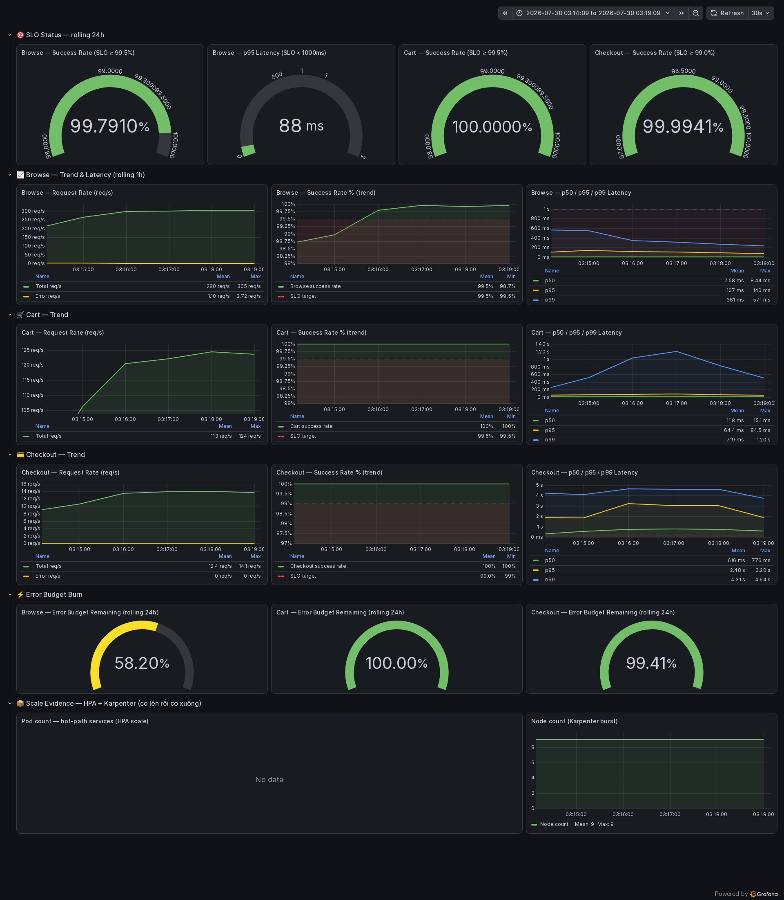
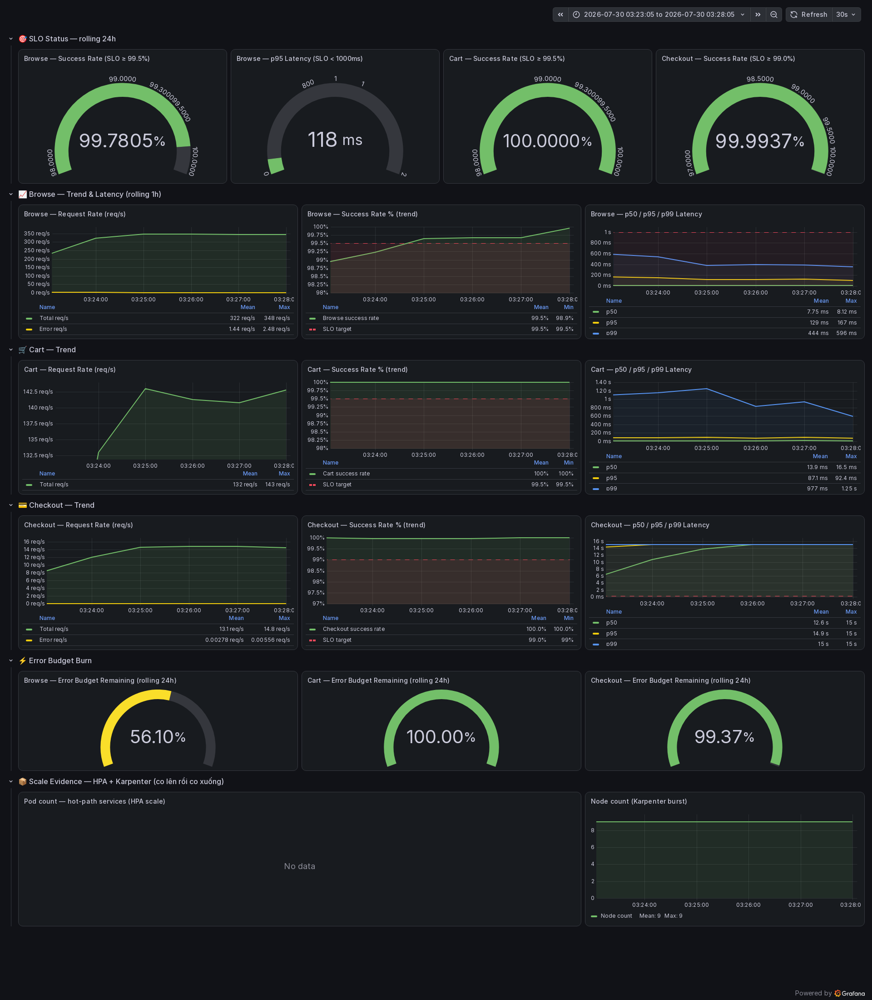
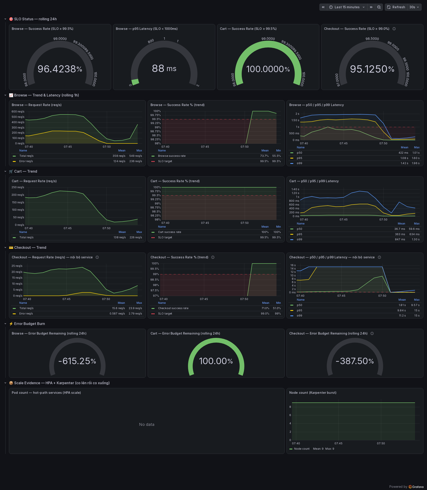
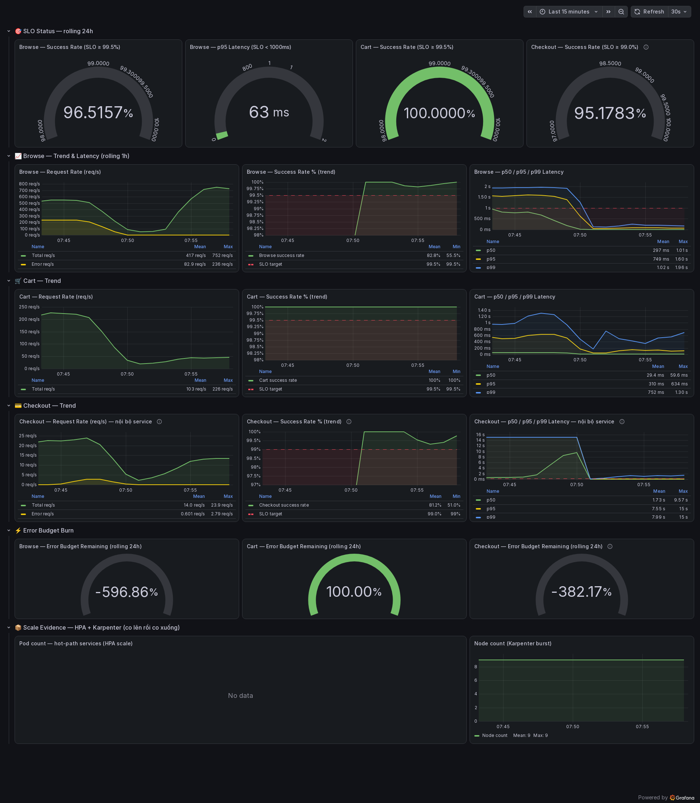
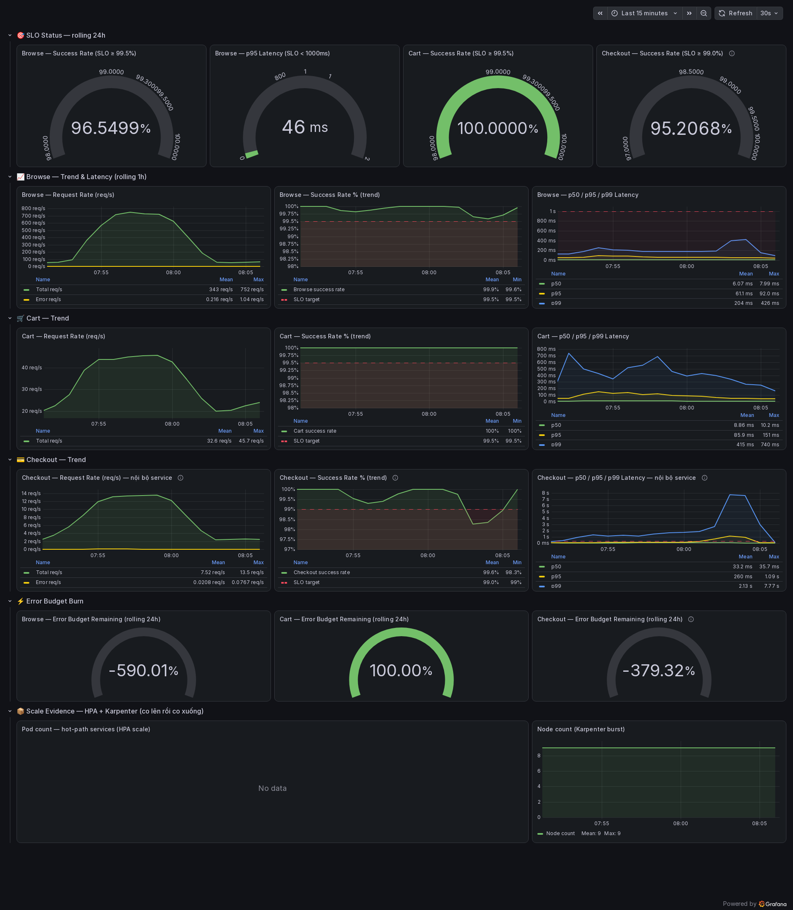
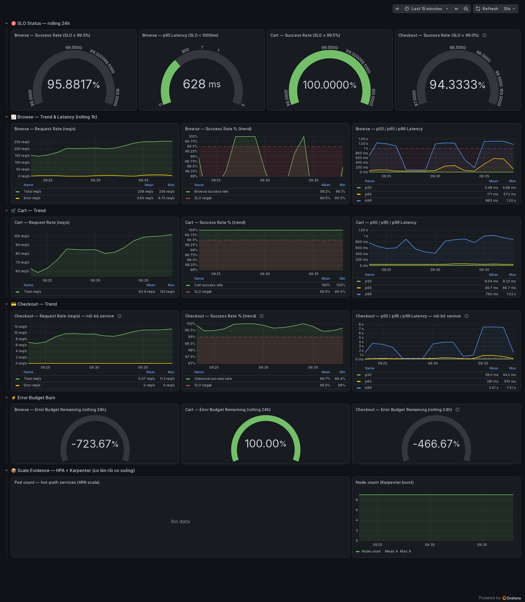
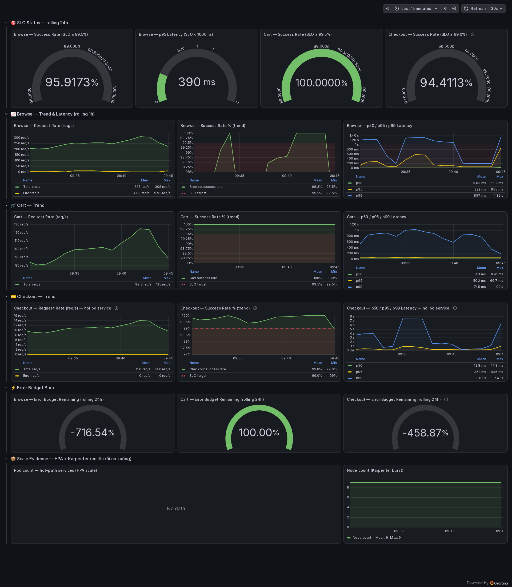

# Mandate #19 — Báo cáo tóm tắt (bản dễ đọc)

**Ngày đo:** 30/07/2026 · **Người thực hiện:** CDO01 — TF3
**Bản đầy đủ:** [`mandate-19-throughput-ceiling-report.md`](mandate-19-throughput-ceiling-report.md) ·
**ADR ký tên:** [`adr/0011-...`](adr/0011-mandate-19-throughput-ceiling-load-shedding.md) ·
**Evidence thô:** [`evidence/mandate-19/real-2026-07-30/`](evidence/mandate-19/real-2026-07-30/)

> Bản này dành cho người đọc lần đầu. Mỗi con số đều có ảnh hoặc file thô đi kèm, bấm vào xem được.

---

## Directive hỏi gì, chúng tôi trả lời được gì

| Câu hỏi của Directive | Trả lời | Trạng thái |
|---|---|---|
| Trần thật của hệ là bao nhiêu? | **1000 user đồng thời · 202,4 RPS** | ✅ |
| Nâng trần được không mà **không thêm node**? | Phục vụ **+29% request** trên **cùng 9 node** — nhưng cổng SLO 4/4 chưa qua | 🟡 |
| Service nào bão hoà sớm nhất? | **`email`** — nghẽn **hàng đợi**, không phải CPU | ✅ |
| Vượt trần thì gục hay xuống mềm? | **Xuống mềm** — hy sinh 104.264 request browse, giữ luồng tiền **99,95%** | ✅ |

---

## 1. Cách đo — vì sao tin được

Số cũ trong repo (*"trần 174,75 RPS @ 328 user"*) đã bị **loại bỏ**, vì ba lý do:

- Ảnh evidence cũ cho thấy **node trôi 9 → 10 → 11** giữa bài. Directive đòi "không thêm node", nên mọi so sánh mất cơ sở.
- Nhiều stage chỉ chạy 59 giây–4 phút, dưới mức tối thiểu 5 phút.
- Kết luận FAIL dựa trên ngưỡng *"checkout p99 ≤ 300ms"* — **ngưỡng này không tồn tại trong `SLO.md`**.

Cách đo mới:

| Hạng mục | Giá trị |
|---|---|
| Mỗi stage | 7 phút, **chỉ lấy 300 giây cuối** (bỏ giai đoạn tăng tải) |
| Máy bắn tải | **Ngoài cluster**, đi qua CloudFront công khai — không tranh CPU với hệ đang đo |
| Cổng đánh giá | Đúng 4 ngưỡng trong `SLO.md`, query lấy nguyên từ `slo-dashboard.json` |
| Mỗi stage đều lưu | số node + **mã hash** của tập node, bảng HPA, CPU từng node |

**Bốn cổng SLO:** browse ≥ 99,5% · browse p95 < 1s · cart ≥ 99,5% · checkout ≥ 99,0%.

> ### ⚠️ Một lỗi phương pháp chúng tôi tự phát hiện và tự sửa giữa chừng
> Ban đầu lấy số throughput từ Prometheus. **Sai.** Phát hiện vì stage 800 user báo throughput
> *thấp hơn* stage 600 user, trong khi máy bắn tải gửi y hệt nhau. Đối chiếu từng route thì
> **mọi route giảm đúng cùng hệ số 1,688×** — dấu hiệu mất dữ liệu, không phải hệ chậm đi.
> Log `otel-gateway` xác nhận: `Exporting failed. Dropping data. dropped_items=8645 / 8365 / 10100`.
>
> **Cách xử:** tỉ lệ (%) vẫn đọc từ Prometheus (mất đều thì tử/mẫu cùng co), còn **con số tuyệt
> đối (RPS) đọc từ máy bắn tải** — đo tại người dùng, không qua đường ống nào.

### Đối chiếu với ba con số "trần" đang cùng tồn tại trong repo

Trong repo hiện có **ba** con số trần khác nhau. Chúng **không mâu thuẫn** — chúng đo ba thứ
khác nhau. Ghi rõ ở đây để người review không phải tự suy luận:

| Nguồn | Trần công bố | Đo cái gì | Vì sao khác |
|---|---|---|---|
| `docs/evidence/report.md` (PM-152, bản gốc) | 328 user / **174,75 RPS** | — | Chính tác giả đã rút lại: không có CSV exact-window để chứng minh |
| `docs/evidence/report.md` (PM-152, [PR #634](https://github.com/tuu-ngo/Phase3-TF3-Infra-Sentinel/pull/634)) | 400 user / **76,2 RPS** | **RPS tức thời** đọc từ *một* ảnh chụp Grafana | Là giá trị *snapshot* tại một thời điểm, không phải trung bình duy trì. Tác giả đã tự ghi rõ điều này trong PR |
| **Báo cáo này** | **1000 user / 202,4 RPS** | **RPS trung bình duy trì suốt 300 giây**, tính từ CSV Locust | Đo tại client, cửa sổ đo cố định, có hash tập node kèm mỗi stage |

Ba điểm cần nắm:

1. **76,2 RPS và 202,4 RPS không so sánh trực tiếp được.** Một cái là kim đồng hồ tại một giây;
   một cái là quãng đường đi trong 5 phút. Bắn cùng một tải mà đọc bằng hai thước này sẽ ra hai số.
2. **Cả hai con số PM-152 đều thiếu ràng buộc "không thêm node"** — ảnh evidence của bài đo cũ cho
   thấy node trôi 9 → 10 → 11 giữa bài. Directive #19 đòi giữ nguyên số node, nên bài đo cũ không
   dùng làm gốc so sánh được, bất kể con số là bao nhiêu.
3. **Không phải bài đo cũ sai, mà là nó trả lời câu hỏi khác.** PM-152 hỏi "hệ chịu được bao nhiêu";
   Mandate #19 hỏi "trần ở đâu, và nâng được bao nhiêu **trên cùng một tập node**". Câu thứ hai bắt
   buộc phải đo lại từ đầu — đó cũng chính là lý do YC#2 phải lấy trần mới, xem [§5](#vì-sao-cổng-44-vẫn-chưa-qua--giải-thích-đầy-đủ).

---

## 2. Trần thật: 1000 user / 202,4 RPS

| Users | RPS phục vụ | browse | cart | checkout | |
|---:|---:|---:|---:|---:|---|
| 800 | 164,1 | 99,977% | 99,991% | 100% | ✅ |
| **1000** | **202,4** | **99,610%** | **100%** | **99,89%** | ✅ **← TRẦN** |
| 1400 | 238,8 | 99,585% | 99,988% | **29,21%** | ❌ |
| 1800 | 298,2 | 99,019% | 99,991% | 7,12% | ❌ |
| 2400 | 342,4 | 84,763% | 99,982% | 0,02% | ❌ |

**Cao hơn ~3× con số cũ.** Và điều bất ngờ: thứ gãy trước tiên **không phải browse mà là checkout** — rơi thẳng từ 99,89% xuống 29,21% chỉ trong một nấc tải.

Ảnh dashboard tại đúng cửa sổ đo (time picker nằm trong ảnh, tua lại được):

| Trần — 1000 user | Vỡ — 1400 user |
|---|---|
| [](evidence/mandate-19/real-2026-07-30/baseline/u1000/grafana-slo.png) | [](evidence/mandate-19/real-2026-07-30/baseline/u1400/grafana-slo.png) |

Ảnh 8 stage đầy đủ: [`baseline/u200`](evidence/mandate-19/real-2026-07-30/baseline/u200/grafana-slo.png) · [`u400`](evidence/mandate-19/real-2026-07-30/baseline/u400/grafana-slo.png) · [`u600`](evidence/mandate-19/real-2026-07-30/baseline/u600/grafana-slo.png) · [`u800`](evidence/mandate-19/real-2026-07-30/baseline/u800/grafana-slo.png) · [`u1000`](evidence/mandate-19/real-2026-07-30/baseline/u1000/grafana-slo.png) · [`u1400`](evidence/mandate-19/real-2026-07-30/baseline/u1400/grafana-slo.png) · [`u1800`](evidence/mandate-19/real-2026-07-30/baseline/u1800/grafana-slo.png) · [`u2400`](evidence/mandate-19/real-2026-07-30/baseline/u2400/grafana-slo.png)

---

## 3. Nút thắt — ba cái, và **hai trong ba không phải CPU**

### 3.1. `email` — nghẽn hàng đợi, không phải chậm

Đây là phát hiện quan trọng nhất về checkout. Hai con số cạnh nhau đủ nói hết:

| Đo ở đâu | p95 |
|---|---:|
| Từ **phía checkout** gọi sang email | **15 000 ms** |
| Bên trong **email** xử lý | **391 ms** |

**14,6 giây chênh lệch đó là thời gian XẾP HÀNG**, không phải thời gian làm việc. Đúng loại bão hoà mà Directive gọi tên: *"không phải chậm — mà cạn: connection/queue depth"*.

Vì sao nó kéo sập checkout: `checkout` gọi email **đồng bộ** và không đặt hạn riêng, nên hàng đợi của email ăn trọn ngân sách thời gian của cả đơn hàng → **504 Gateway Timeout**.

> Ở stage 1400 user: **3.432 trên 5.431 đơn hàng hỏng — chiếm 82% toàn bộ lỗi.**

Vì sao 1 pod không đủ: `email` viết bằng Ruby (có GIL, thực chất dùng được ~1 lõi) mà giới hạn CPU chỉ **100m = 0,1 lõi**, trong khi tải là 14,7 request/giây × 391ms ≈ **5,8 request cùng lúc**.

**Đã sửa:** HPA 2..8 pod + giới hạn CPU `100m → 600m`.

| checkout ở 1400 user | Trước | Sau |
|---|---:|---:|
| Tỉ lệ đặt hàng thành công | **29,21%** | **99,55%** |

### 3.2. Kết nối bị ghim vào một pod — lý do "thêm replica" vô dụng

`product-catalog` đang chạy **11 pod**. Đo CPU từng pod:

```
xxhsp 353m · cw8nx 136m · pzcxg 11m · TÁM pod còn lại 1-2m
```

**Tám pod rỗng hoàn toàn.** Nguyên nhân: Kubernetes Service thường trả về **một địa chỉ ảo duy nhất**; gRPC giữ **một kết nối TCP dài hạn** tới địa chỉ đó; kube-proxy ghim kết nối vào **một pod**. Pod nào được HPA tạo ra *sau* khi kết nối đã dựng thì **không bao giờ** nhận được request.

Hệ quả kép: HPA nhìn thấy CPU **trung bình 48%** nên ngừng scale, trong khi pod nóng chính là pod làm vỡ deadline và sinh lỗi 500.

*Đối chứng ngay trong cụm:* `frontend` trải đều **123–138m** — vì tuyến `frontend-proxy → frontend` đã dùng "headless service" từ trước. Cách làm đúng đã có sẵn trong repo, chỉ chưa áp cho tuyến `frontend → backend`.

**Đã sửa** (headless service + `round_robin` phía client) — bằng chứng: [`roundrobin-proof/before-after.txt`](evidence/mandate-19/real-2026-07-30/roundrobin-proof/before-after.txt)

| `product-catalog` | Trước | Sau |
|---|---|---|
| CPU từng pod | `353m · 136m · 11m · **1m × 8**` | `55m · 31m · 20m · 15m` |
| Lệch nóng/lạnh | **353 lần** | **3,7 lần** |
| Pod thực sự nhận traffic | **2/11** | **4/4** |

### 3.3. Hạn chờ 500ms quá nhạy

Log frontend: `DEADLINE_EXCEEDED after 0.500s`. Nhưng `product-catalog` xử lý p95 chỉ **6,9ms** — hạn chờ không thấp so với mức bình thường, nó **quá sát phần đuôi**. Và vì không có retry, mỗi lần chạm hạn là một lỗi cứng: **311 lỗi 500 + 431 lỗi 503 = 742 lỗi** trên browse.

**Đã sửa:** nới 500ms → 1200ms (vẫn chặn treo vô hạn, chỉ thôi cắt vào đuôi bình thường).

---

## 4. Xuống mềm khi vượt trần — phần chạy tốt nhất

Đẩy **597 request/giây ≈ 3× trần**, bắn qua **đúng đường người dùng thật** (CloudFront công khai):

| Nhóm route | Loại | Số request | Số hỏng | Kết quả |
|---|---|---:|---:|---|
| `GET /api/products` | có thể hy sinh | 190.378 | 83.607 | **83.495 lần trả 429** |
| `GET /` | có thể hy sinh | 47.358 | 20.780 | **20.769 lần trả 429** |
| `GET /api/cart` | **được bảo vệ** | 4.389 | **1** | **99,977%** |
| `POST /api/checkout` | **được bảo vệ** | 4.388 | **1** | **99,977%** |
| `GET /api/products/:id` | **được bảo vệ** | 4.391 | **5** | **99,886%** |

> **Hy sinh 104.264 request duyệt hàng để giữ luồng tiền ở 99,95%. Hệ không sập.**

Counter bên trong Envoy chứng minh chính cơ chế rate-limit đã chặn, chứ không phải tầng nào khác:

| Bucket | bật | **bị chặn** | cho qua |
|---|---:|---:|---:|
| `browse_rate_limiter` (nhóm hy sinh) | 106.883 | **19.539** | 87.344 |
| `local_rate_limiter` (**bảo vệ luồng tiền**) | 148.919 | **0** | 148.919 |

Bucket bảo vệ luồng tiền **không chạm tới một lần nào** trong 148.919 request.

### 🎬 Video demo

| | |
|---|---|
| **Video (nét, đọc được số):** | [`shed-demo/timelapse.mp4`](evidence/mandate-19/real-2026-07-30/shed-demo/timelapse.mp4) |
| **Ảnh động xem nhanh:** | [`shed-demo/timelapse.gif`](evidence/mandate-19/real-2026-07-30/shed-demo/timelapse.gif) |
| **Log probe qua CloudFront:** | [`probe.txt`](evidence/mandate-19/real-2026-07-30/shed-demo/probe.txt) |
| **Counter Envoy:** | [`counters.txt`](evidence/mandate-19/real-2026-07-30/shed-demo/counters.txt) |


Ba mốc trong lúc overload — chú ý panel **Node count: Mean 9 / Max 9** (không hề thêm node):

| Trước khi phóng tải | Đỉnh overload — browse **716 req/s** | Cuối cửa sổ |
|---|---|---|
| [](evidence/mandate-19/real-2026-07-30/shed-demo/frames/01-truoc-overload.png) | [](evidence/mandate-19/real-2026-07-30/shed-demo/frames/02-dang-overload.png) | [](evidence/mandate-19/real-2026-07-30/shed-demo/frames/03-cuoi-overload.png) |

> **Điểm dễ hiểu nhầm:** trên Grafana, tỉ lệ thành công của browse **không tụt** khi cơ chế hoạt
> động. Đó là **đúng thiết kế** — mã 429 bị chặn ngay tại Envoy nên không bao giờ tới `frontend`,
> và `SLO.md` định nghĩa browse là "không lỗi 5xx", mà 429 không phải 5xx. Nói cách khác: hệ hy
> sinh browse **mà không đốt ngân sách lỗi**.

### Một lỗi chúng tôi tự gây ra và tự sửa

PR trước đó nới `frontend-proxy` từ 8 lên 12 pod để tăng trần. Nhưng ngân sách rate-limit tính **theo từng pod**, nên tổng ngân sách vô tình tăng 400 → 600 và **vô hiệu hoá luôn lớp bảo vệ**:

| Bản | proxy tối đa | Số 429 ở 2400 user | browse |
|---|---:|---:|---:|
| gốc | 8 | **3.641** | 84,8% |
| sau khi nới replica | 12 | **0** | **63,4%** |

Cùng mức tải, cùng hạ tầng: bản **nhiều pod hơn** lại **mất** khả năng xuống mềm và browse rơi tự do. Đã hiệu chỉnh lại ngân sách (50 → 33 mỗi pod) và cơ chế hoạt động trở lại.

---

## 5. Nâng trần — phần chỉ đạt một phần, nói thẳng

### Điều **không** hiệu quả

Nới `maxReplicas` cho toàn bộ hot path (frontend 8→16, checkout 8→14, proxy 8→12, catalog 8→12), đo lại đủ 8 stage: **trần không đổi**, vẫn 1000 user, RPS 202,8 vs 202,4 — nằm trong sai số.

Lý do ở mục 3.2: replica thêm vào là dung lượng **traffic không tới được**.

### Điều **có** hiệu quả

Sau khi sửa đúng nguyên nhân (phân bố kết nối):

| Users | RPS: gốc → sau | checkout: gốc → sau |
|---:|---|---|
| 1400 | 238,8 → **277,7** | 29,21% → **99,55%** |
| 1800 | 298,2 → **355,7** | 7,12% → **99,18%** |
| 2400 | 342,4 → **442,3** (**+29%**) | 0,02% → **88,59%** |

**+29% request phục vụ trên đúng 9 node đó**, và luồng tiền sống sót ở mức tải mà trước đây nó gần như chết hẳn.

| Vùng trần sau khi sửa — 1000 user | Vượt trần — 1400 user |
|---|---|
| [](evidence/mandate-19/real-2026-07-30/tuned3-ceiling-video/frames/01-u1000-tran.png) | [](evidence/mandate-19/real-2026-07-30/tuned3-ceiling-video/frames/02-u1400-vuot-tran.png) |

🎬 Video vùng trần: [`tuned3-ceiling-video/timelapse.gif`](evidence/mandate-19/real-2026-07-30/tuned3-ceiling-video/timelapse.gif)

### Vì sao cổng 4/4 vẫn chưa qua — giải thích đầy đủ

`browse` dính **~1–2% lỗi ở mọi mức tải**, kể cả 400 user, nên chỉ stage 200 user qua được cả
bốn cổng. Chúng tôi **không tuyên PASS**. Nhưng lý do đằng sau con số đó cần được hiểu đúng,
vì nó không phải "hệ yếu đi".

#### Lý do 1 — Hệ đã đổi hành vi, nhưng các tham số điều chỉnh thì chưa

Bản vá thay đổi **cách traffic đi trong hệ**, không phải thay đổi dung lượng. Trước đây mỗi pod
frontend nói chuyện với đúng một pod backend; giờ mọi pod frontend chia đều lên mọi pod backend.
Đó là một chế độ vận hành **khác hẳn**.

Nhưng toàn bộ tham số điều chỉnh hiện tại — `minReplicas`, ngưỡng HPA 65%, hạn chờ gRPC 1200ms —
đều được hiệu chỉnh cho **chế độ cũ**. Chúng chưa từng được đo lại trong chế độ mới.

Bằng chứng cho thấy đây **không phải cạn dung lượng**: lỗi không rải đều theo thời gian mà **dồn
thành từng cụm ngắn rồi tự tắt**, trong khi tài nguyên còn thừa.

| Stage | Cụm lỗi | Dài | Vị trí trong cửa sổ đo 300s |
|---|---|---:|---|
| u400 | 09:22:27 → 09:22:35 | **8s** | +263s |
| u600 | 09:28:51 → 09:29:56 | 65s | +204s |
| u800 | 09:34:12 → 09:37:02 | 170s | +90s |
| u1000 | 09:43:58 → 09:44:12 | **14s** | +240s |

Hai điều loại trừ được giả thuyết "hết sức":

**(a) Tài nguyên còn thừa nhiều** đúng lúc đó — ảnh HPA tại u1000:

```
frontend-hpa          cpu:  79%/65%    10/16 replica   (còn 6)
product-catalog-hpa   cpu:  61%/65%     8/12 replica   (DƯỚI cả ngưỡng)
```

**(b) Cụm lỗi ở +90s đến +263s vào giữa cửa sổ đo** — đã qua giai đoạn ổn định từ lâu, nên không
đổ cho "nhiễu lúc tăng tải" được.

> #### ⚠️ Đính chính một suy luận sai của bản đầu
> Bản đầu viết: *"pod bão hoà → sinh lỗi → ~25 giây sau HPA thêm pod → lỗi dừng"*. **Chuỗi nhân
> quả này mâu thuẫn với chính bảng số của nó:** cụm lỗi u400 **tắt lúc 09:22:35**, còn HPA scale-up
> mãi **09:22:56** — tức lỗi đã hết **21 giây TRƯỚC** khi có pod mới. Pod mới không thể là thứ
> chữa lỗi đã tự tắt trước đó.

**Cơ chế đúng — và đây là chỗ bản vá của chúng tôi còn thiếu một mảnh:**

`round_robin` được ship **mà không kèm `retryPolicy`**. Xem `grpcChannel.ts`: service config chỉ
có `loadBalancingConfig`, không có `methodConfig`.

| | `pick_first` (trước) | `round_robin` (nay) |
|---|---|---|
| Client giữ kết nối tới | **1** pod | **tất cả** pod |
| Một pod bị thay | chỉ client ghim vào nó dính | **mọi** client dính một phần |
| Cửa sổ dính lỗi | tới khi hết backoff (~60s) | tới khi phân giải lại DNS |

`dns_min_time_between_resolutions_ms: 5000` ⇒ sau khi một pod biến mất, client còn gửi vào địa chỉ
chết **tới 5 giây**. **Cụm lỗi 8 giây ở u400 khớp đúng con số này.** Không có `retryPolicy`, mỗi
lần như vậy là lỗi 500 tới thẳng người dùng.

Nói gọn: bản vá đổi *"một pod chịu toàn bộ rủi ro"* thành *"mọi pod chia nhau rủi ro"* — đúng ý đồ
về dung lượng, nhưng **thiếu lớp đệm bắt buộc đi kèm**. Đây là thứ sửa được bằng một vòng nữa, xem
👉 **[kế hoạch đóng YC#2](mandate-19-ke-hoach-yc2.md)**.

#### Lý do 2 — Cơ chế cũ vô tình được "che" bởi chính khuyết điểm của nó

Đây là điểm dễ bị hiểu ngược nhất, nên nói kỹ.

Ở bản gốc, mỗi pod frontend ghim vào **một** pod backend riêng. Khi backend đó quá tải, chỉ phần
frontend ghim vào nó bị ảnh hưởng; các frontend khác vẫn nói chuyện với backend rảnh của mình và
**hoàn toàn sạch lỗi**. Tức khuyết điểm "ghim kết nối" vô tình tạo ra **sự cách ly**.

Cái giá của sự cách ly đó: **8/11 pod không bao giờ nhận request** — dung lượng đã trả tiền mà
không dùng được. Hệ *trông* khoẻ ở 1000 user vì nó chưa bao giờ thực sự chạm tới dung lượng của
chính mình; nó gãy dứt điểm ở 1400 khi checkout sụp xuống **29,21%**.

Sau khi bỏ ghim, dung lượng được dùng hết (**+29% RPS**) nhưng cách ly cũng mất theo: backend
chạm trần thì **mọi** request cùng chịu một chút. Lỗi đi từ *dồn cục bộ* sang *rải đều mỏng*.

Cùng một hệ, hai chế độ hỏng khác nhau:

| | Bản gốc | Sau khi sửa |
|---|---|---|
| Kiểu hỏng | **dồn cục** — checkout sụp 29,21% ở 1400 user | **rải mỏng** — browse ~1% đều |
| Dung lượng dùng được | 2/11 pod | **4/4 pod** |
| RPS phục vụ @2400 | 342,4 | **442,3** |

#### Lý do 3 — Cổng "stage cao nhất qua cả 4" không đo được thứ đã cải thiện

Cổng SLO là **ngưỡng nhị phân**: 99,5% đạt, 99,4% trượt — bất kể phía sau con số đó là gì.

Với thước đo này, việc checkout ở 1800 user đi từ **7,12% lên 99,18%** — tức từ *gần như không
đặt được hàng* sang *gần như đơn nào cũng qua* — **không được tính điểm nào**, chỉ vì browse
thiếu 2 điểm phần trăm ở cùng stage.

Chúng tôi **không** dùng lập luận này để đòi PASS. Cổng là cổng, và chúng tôi báo là chưa qua.
Nêu ra để người đọc thấy đủ hai mặt: một thước đo nhị phân không phản ánh được việc luồng ra
tiền của hệ đã được cứu.

#### Lý do 4 — Phần còn lại đã chạm đến giới hạn hạ tầng, không còn là phần mềm

Ở mức tải cao nhất, **13 pod xếp hàng không xin được chỗ**, trong khi **4 node đã trả tiền ngồi
ở 18–58% CPU** và không bao giờ nhận được pod hot-path (mục 6). Đây không phải thứ sửa được bằng
tuning — nó là một quyết định kiến trúc thuộc về Mandate #13 của CDO01.

#### Tóm lại

| Câu hỏi | Trả lời thẳng |
|---|---|
| Bản vá có sai không? | Không. Nó chạm đúng nguyên nhân, và phân bố tải đã sửa được thật: **353× → 3,7×** |
| Có làm hệ tệ đi không? | Không, ở tải cao: **+29% RPS**, checkout `7,12% → 99,18%` |
| Vậy sao chưa PASS? | Tham số HPA/hạn chờ vẫn là bộ hiệu chỉnh cho chế độ cũ; cần **một vòng đo lại** trong chế độ mới |
| Cần bao lâu để chốt? | **~2,5–3 giờ** — chi tiết từng việc ở 👉 **[kế hoạch đóng YC#2](mandate-19-ke-hoach-yc2.md)** |
| Chắc chắn qua không? | **Không dám chắc.** ~55% nếu chỉ thêm `retryPolicy` + giảm churn; **~70%** nếu nới được `product-reviews`; **~85%** nếu CDO01 đồng ý mở 4 node `t3.large`. Qua được u1800 thì **<25%** nếu không mở node |

## 6. Trần cuối cùng **không còn nằm ở phần mềm**

Ở stage 2400 user có **13 pod xếp hàng không xin được chỗ**:

```
0/9 nodes are available:
  4 node(s) didn't match Pod's node affinity/selector   ← 4 node t3.large managed
  1 Insufficient cpu                                    ← tầng elastic đã cạn
node limits have been exhausted for nodepool (flash-sale-spot-arm64)
label "techx.io/arch" does not have known values
```

CPU thật từng node **cùng thời điểm đó**:

| Node | CPU | Dùng được cho hot path? |
|---|---:|---|
| elastic `…5-127` | **99%** | ✅ đang cạn |
| elastic `…34-80` | 62% | ✅ |
| **managed `…24-177`** | 58% | ❌ |
| **managed `…8-134`** | 49% | ❌ |
| **managed `…26-153`** | 29% | ❌ |
| **managed `…43-83`** | 18% | ❌ |

Cấu hình `values-mandate13.yaml` giam 10 workload hot path bằng
`nodeSelector: { techx.io/workload: elastic, techx.io/arch: arm64 }`. **Bốn node `t3.large` không mang nhãn đó nên không bao giờ nhận được pod hot-path** — chúng ngồi ở 18–58% CPU trong khi node elastic chạm 99% và 13 pod xếp hàng.

Còn tầng elastic thì đụng trần cứng do chính mình đặt:

| NodePool arm64 | `limits.nodes` |
|---|---:|
| `flash-sale-spot-arm64` | 2 |
| `elastic-ondemand-fallback-arm64` | 2 |
| **Tối đa** | **4 node** |

> ### ⚠️ Một chỗ chúng tôi đọc sai log và đã sửa
> Hai dòng cuối trong thông báo trên **thuộc về hai NodePool khác nhau**, không phải một lý do chung:
>
> - `node limits have been exhausted for nodepool (flash-sale-spot-arm64)` → pool **arm64**, hết quota node.
> - `label "techx.io/arch" does not have known values` → pool **amd64** (`flash-sale-spot`,
>   `elastic-ondemand-fallback`). Hai pool này thật sự không mang label đó, và **đó là đúng**:
>   pod đã ghim arm64 thì không nên rơi vào node amd64.
>
> Bản đầu của báo cáo kết luận nhầm rằng *NodePool arm64 thiếu khai báo `techx.io/arch`*. **Không
> phải.** Cả hai pool arm64 đã có label ở `template.metadata.labels`
> (`gitops/karpenter/spot-nodepool.yaml:88` và `ondemand-fallback-nodepool.yaml:92`), và Karpenter
> tự đưa static label của template vào ràng buộc của node sắp tạo — không cần lặp lại ở `requirements`.
>
> Kiểm chứng nhanh nhất không cần đọc cấu hình: **node elastic `…5-127` đang chạy 99% CPU** ngay tại
> snapshot này. Nếu label thiếu thật thì tầng elastic đã rỗng, và bản tuned3 442,3 RPS không thể tồn tại.
>
> **Việc cần làm vì thế cũng đổi:** không phải "sửa `requirements`" (không có gì để sửa) mà là nâng
> `limits.nodes` — nhưng đó là trần **cố ý** của CDO01 để giữ chi phí, nên phải cân với ngân sách.

Chi tiết: [`ceiling-root-cause.txt`](evidence/mandate-19/real-2026-07-30/ceiling-root-cause.txt)

> ### 👉 Đòn bẩy tiếp theo — và nó đúng nghĩa "nâng trần bằng hiệu suất, không thêm node"
> **8 vCPU đã trả tiền đang nằm không.** Image đã build đa kiến trúc (`linux/amd64,linux/arm64`)
> nên về kỹ thuật hot path chạy được trên `t3.large`.
>
> **Chưa làm** vì nó sửa thiết kế Mandate #13 của CDO01 (ghim Graviton để tiết kiệm chi phí) —
> cần thống nhất trước, không đơn phương.

---

## 7. Những gì phát hiện thêm (không nằm trong Directive nhưng đáng báo)

| Vấn đề | Vì sao đáng lo |
|---|---|
| **cAdvisor chết ở 7/8 node** — `context deadline exceeded` trên port 10250 | Không có metric container toàn cụm. Panel *"Pod count"* luôn `No data`. **Chúng tôi không dùng panel đó làm bằng chứng**; số per-pod lấy từ `kubectl top` |
| **Tầng elastic arm64 có trần cứng 4 node** | `limits.nodes: 2` × 2 NodePool. Là quyết định chi phí cố ý của CDO01, **không phải lỗi** — nêu ở đây để khi cần nâng trần thì biết chỗ vặn. (Bản đầu báo cáo này ghi nhầm nguyên nhân là "NodePool thiếu label" — đã đính chính ở §6) |
| **SLI checkout từng mù** | Panel SLO đo trên span **nội bộ** service checkout, nên request timeout ở tầng trên vô hình. Ở 2400 user: **8.875/8.877 đơn hỏng** mà dashboard vẫn báo `checkout_success = 100%`. **Đã sửa** — nay đo ở biên |
| **Sự cố production 42 phút hôm nay** | `product-catalog` bị đưa về 0 replica → `/api/products` trả 500. HPA **không bao giờ scale từ 0 lên**, và GitOps không có field `replicas` để khôi phục → chỉ `kubectl scale` cứu được. **10 service khác cùng lỗ hổng.** Xem [postmortem 0017](postmortem/0017-product-catalog-replicas-zero-hpa-cannot-recover.md) |

---

## 8. Cách tự kiểm chứng lại

```sh
# mở tunnel + prometheus
kubectl -n techx-tf3 port-forward svc/prometheus 29090:9090

# chạy một stage bất kỳ
bash scripts/mandate-19/run_stage_external.sh <tên-arm> <số-user> 420 300

# tổng hợp số client-side
python3 scripts/mandate-19/client_truth.py <thư-mục-arm>

# demo xuống mềm + tự quay video
kubectl -n techx-tf3 port-forward svc/grafana 23000:80
bash scripts/mandate-19/shed_demo.sh <thư-mục-ra> 120 420
```

Hướng dẫn đầy đủ: [`scripts/mandate-19/README.md`](../scripts/mandate-19/README.md)

---

## 9. Việc còn mở — xếp theo tác động

| # | Việc | Vì sao quan trọng |
|---|---|---|
| **1** | Cho hot path dùng được **4 node `t3.large` managed** | **8 vCPU đã trả tiền đang nằm không**. Cần thống nhất với CDO01 |
| **2** | Nâng `limits.nodes` của 2 NodePool arm64 (trần cứng hiện tại **4 node**) | Karpenter báo `node limits have been exhausted`. Là trần **cố ý** để giữ chi phí ⇒ phải cân với ngân sách, không nâng vô điều kiện |
| 3 | Giảm độ trễ phản ứng HPA cho `product-catalog` | Lỗi dồn thành burst ~8 giây, đều đặn ~25 giây **trước** mỗi lần scale-up |
| 4 | Ngân sách rate-limit dùng chung toàn cluster | Hiện vẫn trôi theo số pod proxy |
| 5 | Sửa cAdvisor 7/8 node | Khôi phục quan sát container toàn cụm |
| 6 | Đặt hạn chờ riêng cho `checkout → email` | Hàng đợi service phụ trợ không được phép ăn trọn ngân sách luồng tiền |
| 7 | Xem lại `replicasManagedExternally` | 10 service có lỗ hổng "về 0 là kẹt vĩnh viễn" |

---

**Ký:** CDO01 — TF3 · 30/07/2026
